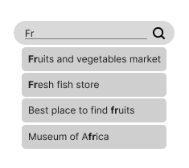

# sherlock
Perform efficient and customized searches on local data. Built-in autocomplete feature for search bars.

<p align="center">
    
</p>

<p align="center">
    Sherlock in the new <b><code>SearchBar</code></b> widget ! (Flutter 3.10.0)<br>
    See this example <a href="/example/search_bar/lib/main.dart">here</a>.
</p>

## Usage
Sherlock needs the elements in which it (he?) will search. Priorities can be specified for results sorting, but it is not mandatory.

```dart
final foo = [
  {
    'col1': 'foo',
    'col2': ['foo1', 'foo2'],
    'col3': <non-string value>,
  },
  // Other elements...
];

// The bigger it is, the more important it is. 
final priorities = {
  'col2': 4,
  'col1': 3,
  // '*': 1,
};

final sherlock = Sherlock(elements: foo, priorities: priorities);
sherlock.query(where: '<column>', regex: r'<regex expression>');

List<Map> results = sherlock.results;
sherlock.forget(); // clear the results

// Other queries...
```

> Note : this package is designed for searches in local data retrieved after an API call or something. It avoids requiring Internet during the search.

See the [examples](example/README.md).

## Overview
See also the [search completion tool](#search-completion-tool).

- ### Create a `Sherlock` instance.
  Prototype
  ```dart
  Sherlock(
    List<Map<String, dynamic>> elements, 
    Map<String, int> priorities = {'*': 1},
    NormalizationSettings normalization = /* defaults */
  )
  ```
  Usage
  ```dart
  /// Users with their first and last name, and the city where they live.
  /// They also have an ID.
  List<Map<String, dynamic>> users = [
    {
      'firstName': 'Finn',
      'lastName': 'Thornton',
      'city': 'Edinburgh',
      'id': 1, // other types than string can be used.
    },
    {
      'firstName': 'Suz',
      'lastName': 'Judy',
      'city': 'Paris',
      'id': 2,
    },
    {
      'firstName': 'Suz',
      'lastName': 'Crystal',
      'city': 'Edinburgh',
      'hobbies': ['sport', 'programming'], // string lists can be used.
      'id': 3,
    },
  ];

  final sherlock = Sherlock(elements: users)
  ```
  Specifying `priorities` :
  ```dart
  // First and last name have the same priority.
  // The city is less important.
  // The default priority is `1`. 
  Map<String, int> priorities = [
    'firstName': 3,
    'lastName': 3,
    'city': 2,
  ];

  final sherlock = Sherlock(elements: users, priorities: priorities);
  ```
  Specifying `normalization` : 
  ```dart
  final normalization = NormalizationSettings(
    normalizeCase: true,
    normalizeCaseType: false,
    removeDiacritics: true,
  );

  final sherlock = Sherlock(elements: users, normalization: normalization);
  ```
- ### Priorities
  The priority map (also known as "priorities") is used to define the priority of each column. If there is no priority set for a column, the default priority will be used instead.

  The default priority value can be specified, otherwise it will be set to `1` :
  ```dart
  // The city is the least important.
  Map<String, int> priorities = [
    'firstName': 3,
    'lastName': 3,
    'city': 1,
    '*': 2,
  ];
  ``` 
- ### Normalization settings
  The normalization settings are used to define the type of normalization that will be performed on the strings during searches.

  Prototype
  ```dart
  NormalizationSettings normalization;
  ```
  ```dart
  /// Out of the [Sherlock] class.

  NormalizationSettings(
    // If `true` : case insensitive.
    // If `false` : case sensitive.
    bool normalizeCase,
    // If `true` : no matter if it is snake or camel cased.
    // If `false` : it matters to be snake or camel cased.
    bool normalizeCaseType,
    // If `true` : keeps the diacritics.
    // If `false` : remove all the diacritics.
    bool removeDiacritics,
  )
  ```
  
  These settings are only used by `query` and `queryMatch`. The [smart search](#smart-search) uses its own normalization settings, which is :
  ```dart
  NormalizationSettings(
    normalizeCase: true,
    normalizeCaseType: false,
    removeDiacritics: true,
  );
  ```

- ### Results
  Performed queries add the matching elements to the field `unsortedResults`, which can be used to get the results as `Result` objects.

  After that, the results can be retrieved sorted and unwrapped.

  Prototypes
  ```dart
  List<Map<String, dynamic>> get results; // sorted results
  List<Result> unsortedResults;

  void forget(); // resets the results
  ```
  ```dart
  /// Out of the [Sherlock] class.
  
  class Result {
    Map<String, dynamic> element;
    int priority;
  }

  List<Result> sortResults(List<Result> unsortedResults);

  extension UnwrapResults on List<Result> {
    List<Map<String, dynamic>> unwrap();
  }
  ```

  Usages
  
  Results sorted following the `priorities` map.
  ```dart
  final sherlock = Sherlock(/*...*/);
  // Queries...
  final results = sherlock.results;
  ```
  Getting results unsorted means the results will be in the order they were found. Each `Result` contain the actual result (an element matching with the query) and its priority.
  ```dart
  final sherlock = Sherlock(/*...*/);
  // Queries...
  final results = sherlock.unsortedResults;
  ```
  Also, the results can be sorted later :
  ```dart
  final unsortedResults = sherlock.unsortedResults;
  final results = sortResults(unsortedResults);
  ```
  But also unwrapped, in order to get elements instead of `Result` objects.
    ```dart
  final results = sortResults(unsortedResults).unwrap();
  ```
  Reset the values to perform new unrelated queries.
  ```dart
  final sherlock = Sherlock(/*...*/);
  // Queries...
  final results = sherlock.results; // save the results.
  sherlock.forget(); // `sherlock.results == []`.
  // Queries...
  ```
- ### Queries
  Prototypes
  ```dart
  void query(
    String where = '*', 
    String regex, 
    NormalizationSettings specificNormalization = /* this.normalization */,
  ) 
  ```
  Usage
  ```dart
  /// All elements having a title, which contains the word 'game' or 'vr'.
  sherlock.query(where: 'title', regex: r'(game|vr)');

  /// All elements with in at least one of their fields which contain the word 
  /// 'cat'.
  sherlock.query(regex: r'cat');

  /// All elements having a title, which is equal to 'movie theatre'.
  sherlock.query(where: 'title', regex: r'^Movie Theatre$');

  /// All elements having a title, which is equal to 'Movie Theatre', the case 
  /// matters.
  sherlock.query(
    where: 'title', 
    regex: r'^Movie Theatre$', 
    specificNormalization: NormalizationSettings(
      normalizeCase: false,
      // other normalization settings are the one of [this.normalization].
    )
  );

  /// All elements with both words 'world' and 'pretty' in their descriptions.
  sherlock.query(where: 'description', regex: r'(?=.*pretty)(?=.*world).*');
  ```
  Prototype
  ```dart
  /// Searches for elements where [what] exists (is not null) in the column [where].
  void queryExist(String where, String what)
  ```
  Usage
  ```dart
  /// All activities where monday is specified in the opening hours.
  sherlock.queryExist(where: 'openingHours', what: 'monday');
  ```
  Prototypes
  ```dart
  void queryBool(String where = '*', bool Function(dynamic value) fn)

  void queryMatch(
    String where = '*', 
    dynamic match,
    NormalizationSettings specificNormalization = /* this.normalization */,
  )
  ```
  Usages
  ```dart
  /// All activities having a title which does not correspond to 'Parc'.
  sherlock.queryBool(where: 'title', fn: (value) => value != 'Parc');

  /// All activities starting at 7'o on tuesday.
  sherlock.queryBool(
    where: 'openingHours',
    fn: (value) => value['tuesday'][0] == 7,
  );
  ```
  ```dart
  /// All activities having a title corresponding to 'Parc', the case matters.
  sherlock.queryMatch(
    where: 'title', 
    match: 'Parc',     
    specificNormalization: NormalizationSettings(
      normalizeCase: false,
      // other normalization settings are the one of [this.normalization].
    ),
  );
  ```
  ```dart
  /// All activities having a title corresponding to 'parc', no matter the case.
  sherlock.queryMatch(
    where: 'title', 
    match: 'pArC',     
    specificNormalization: NormalizationSettings(
      normalizeCase: true,
      // other normalization settings are the one of [this.normalization].
    ),
  );
  ```

- ### Smart search

  Prototype
  ```dart
  void search(
    dynamic where = '*', 
    String input,     
    int errorTolerance = 2,
    List<String> stopWords = StopWords.en,
  )
  ```

  Usages
  
  Perfect matches are searched first, it means they will be on top of the `results` if they exist.
  ```dart
  /// All elements having at least one of their field containing the word 'cats'
  sherlock.search(input: 'cAtS');
  /// Elements having their title or their categories containing the word 'cat'
  sherlock.search(where: ['title', 'categories'], input: 'cat');
  ```

## Search completion tool
When doing searches from an user's input, it might be useful to help them completing their search. That's why `SherlockCompletion` exists.

The results could be used in a search widget for example.

## Overview
- ### Create a `SherlockCompletion` instance
  Prototype
  ```dart
  SherlockCompletion(
    String where, 
    List<Map<String, dynamic>> elements,
  )
  ```
  Usage
  ```dart
  final places = [
    {
      'name': 'Africa discovery',
    },
    {
      'name': 'Fruits and vegetables market',
      'description': 'A cool place to buy fruits and vegetables',
    },
    {
      'name': 'Fresh fish store',
    },
    {
      'name': 'Ball pool',
    },
    {
      'name': 'Finland discovery',
    },
  ];

  final completion = SherlockCompletion(where: 'name', elements: places);
  ```
- ### Input
  Prototype
  ```dart
  List<String> input(
    String input,
    bool caseSensitive = false,
    bool? caseSensitiveFurtherSearches,
    int minResults = -1,
    int maxResults = -1,
  )
  ```
  Usage
  ```dart
  // Find all the names starting with 'fr'.
  final a = completion.input(input: 'fr');
  print(a);

  // Find all the names starting with 'Fr', and the case matters.
  final b = completion.input(input: 'Fr', caseSensitive: true);  
  print(b);
  ```
  ```
  [Fruits and vegetables market, Fresh fish store]
  [Fruits and vegetables market, Fresh fish store]
  ```
  ```dart
  // Try to find at least 4 names matching with 'fr'.
  final c = completion.input(input: 'fr', minResults: 4);
  print(c);

  // Try to find at least 3 names matching with 'Fr', and the case matters only 
  // for the searches that might be performed if there is less than 3 results.
  final d = completion.input(
    input: 'Fr', 
    minResults: 3, 
    caseSensitiveFurtherSearches: true,
  );
  print(d)
  ```
  ```
  [Fruits and vegetables market, Fresh fish store, Best place to find fruits, Museum of Africa]
  [Fruits and vegetables market, Fresh fish store]
  ```
  ```dart
  // Find maximum 1 name matching with 'fr'.
  final e = completion.input(input: 'fr', maxResults: 1);
  print(e);
  ```
  ```
  [Fruits and vegetables market]
  ```
- ### Results
  Prototypes
  ```dart
  /// [Sherlock] results.
  List<Map<String, dynamic>> results;

  /// [input] results.
  List<String> input(...);
  ```
  Usage
  ```dart
  List<String> resultNames = completion.input(input: 'fr');
  print('names: $resultNames')

  List<Map<String, dynamic>> resultElements = completion.results;
  print('elements: $resultElements'); 
  ```
  ```
  names: [Fruits and vegetables market, Fresh fish store]
  elements: [
    {
      name: Fruits and vegetables market, 
      description: A cool place to buy fruits and vegetables
    }, 
    {
      name: Fresh fish store
    }
  ] 
  ```

- ### Unchanged ranges of the results
  Prototype
  ```dart
  List<Range> unchangedRanges({
    String input,
    List<String> results,
  )
  ```
  ```dart
  class Range {
    int start;
    int end;
  }
  ```
  Usage

  This can be used to highlight the unchanged part while displaying the possible completions.
  
  What it could look like :
  <p align="center">
    
  </p>

  ```dart
  const input = 'Fr';
  final results = completion.input(input: input, minResults: 4);

  // The case is ignored.
  List<Range> unchangedRanges = completion.unchangedRanges(
    input: input, 
    results: results,
  );

  print(results);
  print(unchangedRanges);
  ```
  ```
  [Fruits and vegetables market, Fresh fish store, Best place to find fruits, Museum of Africa]
  [[0, 2], [0, 2], [19, 21], [11, 13]]
  ```